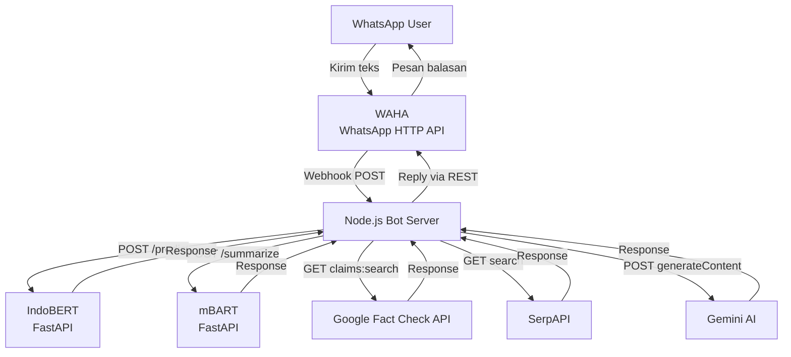

# PRD: Hoax Checker Bot — WhatsApp (WAHA)

## Overview

Bot pendeteksi hoax berbasis WhatsApp yang menganalisis teks pesan secara otomatis menggunakan pipeline ML + AI. Pengguna mengirim teks berita/pesan yang mencurigakan, bot membalas dengan hasil analisis lengkap.

---

## Latar Belakang

Penyebaran hoax di WhatsApp sangat masif karena kemudahan forwarding pesan. Bot ini hadir untuk membantu pengguna memverifikasi klaim secara cepat tanpa harus berpindah aplikasi.

---

## Arsitektur Sistem



---

## Stack Teknologi

| Komponen         | Teknologi                                        |
| ---------------- | ------------------------------------------------ |
| WhatsApp Gateway | WAHA (self-hosted / cloud)                       |
| Bot Server       | Node.js + Express                                |
| BERT Model       | IndoBERT fine-tuned — FastAPI (Colab/GPU server) |
| BART Model       | mBART IndoSum — FastAPI (Colab/GPU server)       |
| Fact Check       | Google Fact Check Tools API                      |
| Web Search       | SerpAPI (Google Search)                          |
| AI Verdict       | Gemini 2.0 Flash API                             |

---

## Pipeline Alur Bot

```
User kirim pesan WhatsApp
        ↓
[WAHA Webhook → Node.js]
        ↓
Step 1: IndoBERT — Klasifikasi Semantik
   → Label: HOAKS / BENAR
   → Confidence: XX.X%
        ↓
Step 2: Cek panjang teks
   ├── < 200 kata → skip ringkasan
   └── ≥ 200 kata → mBART Summarize
        ↓
Step 3: Google Fact Check API
   ├── Ada hasil → tampilkan klaim + rating + sumber
   └── Tidak ada → SerpAPI fallback
                      ↓
                  Ditemukan artikel?
                  ├── Ya → Gemini AI Verdict
                  │         [HOAKS/BENAR/TIDAK DAPAT DIPASTIKAN]
                  │         Confidence + Alasan + Sumber URL
                  └── Tidak → "Tidak ditemukan informasi"
```

---

## Format Output ke User

```
🧠 Analisis Semantik (BERT)
❌ Hasil: HOAKS — Kepercayaan: 98.5%

📄 Ringkasan:  (jika teks panjang)
<ringkasan mBART>

📋 Hasil Fact Check:
1. <klaim> — Rating: SALAH
   Sumber: Independen.id

— atau jika tidak ada di Fact Check DB —

Ditemukan 3 artikel terkait.

🤖 Analisis AI:
[HOAKS] Confidence: 95.2%

Klaim: "..."

Alasan:
1. ...
2. ...

Sumber:
1. Judul Artikel
   https://...
```

---

## Integrasi WAHA

### Terima Pesan (Webhook)

WAHA dikirim ke endpoint bot:

```
POST http://bot-server:3000/webhook
Content-Type: application/json

{
  "event": "message",
  "payload": {
    "from": "628xxx@c.us",
    "body": "isi pesan user"
  }
}
```

### Kirim Balasan (REST API)

```
POST http://waha-server:3000/api/sendText
{
  "chatId": "628xxx@c.us",
  "text": "hasil analisis",
  "session": "default"
}
```

---

## Environment Variables

| Variable             | Keterangan                     |
| -------------------- | ------------------------------ |
| `WAHA_API_URL`       | Base URL WAHA server           |
| `WAHA_SESSION`       | Nama session WAHA              |
| `BART_API_URL`       | URL FastAPI (ngrok/server)     |
| `BERT_API_URL`       | URL FastAPI (sama dengan BART) |
| `FACT_CHECK_API_KEY` | Google Cloud API Key           |
| `SERPAPI_KEY`        | SerpAPI Key                    |
| `GEMINI_API_KEY`     | Google AI Studio Key           |

---

## Non-Functional Requirements

| Aspek          | Target                                 |
| -------------- | -------------------------------------- |
| Response time  | < 30 detik end-to-end                  |
| BERT inference | < 3 detik                              |
| BART summarize | < 20 detik (GPU)                       |
| Fact Check API | < 5 detik                              |
| Gemini verdict | < 10 detik (dengan retry)              |
| Concurrency    | Tiap pesan diproses independen (async) |

---

## Perbedaan vs Versi Telegram

| Aspek           | Telegram                | WAHA (WhatsApp)         |
| --------------- | ----------------------- | ----------------------- |
| Gateway         | `node-telegram-bot-api` | REST API ke WAHA        |
| Inline keyboard | ✅                      | ❌ (kirim teks biasa)   |
| Webhook         | Polling / Webhook       | Webhook wajib           |
| Session         | Stateless               | Stateless               |
| Deployment      | Bot token saja          | Self-host WAHA + Docker |
